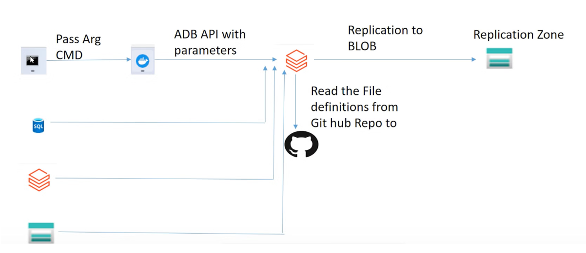

# MLData_Management

This project aims to provide a comprehensive solution for efficient metadata replication and data
lineage management. Leveraging Azure Databricks, Logic Apps, GitHub, Docker, and Unity
Catalog, enables seamless replication, data consistency, and accessibility for diverse business
use cases, empowering enterprises with streamlined data management practices.
# Dataset Description
The code caters to multiple data sources, like CSV, SQL Server, and Delta Live tables. For
demonstration purposes, we will be using a sample customer dataset from Databricks (dbfs:
/databricks-datasets/tpch/delta-001/) and an Employee dataset from a SQL serverTech Stack

# Language: Python, SQL
* Services: SQL Server, Databricks, Azure Storage Account, Azure Logic Apps, Docker, Delta
Live Tables, Git
